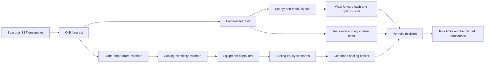
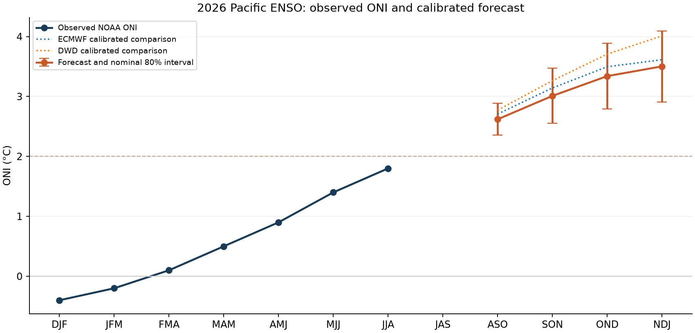
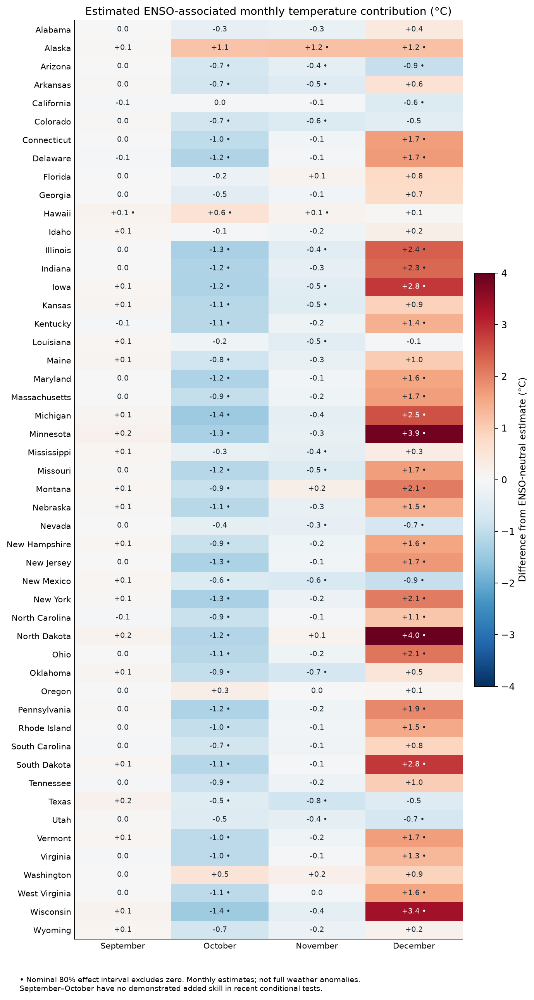
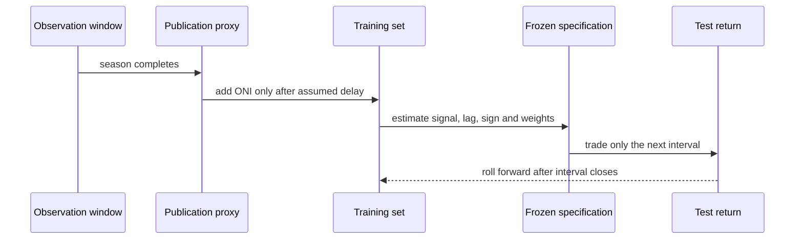
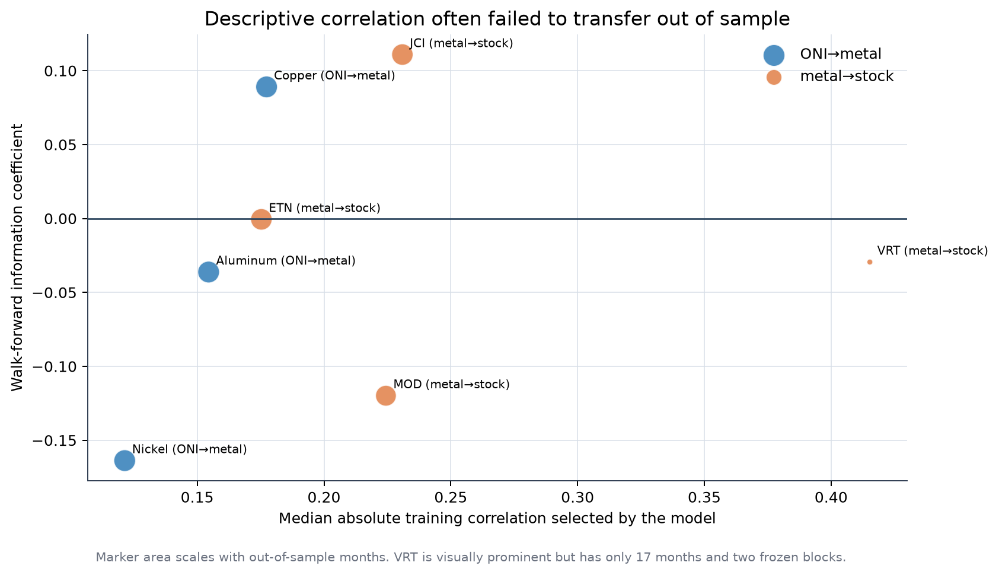
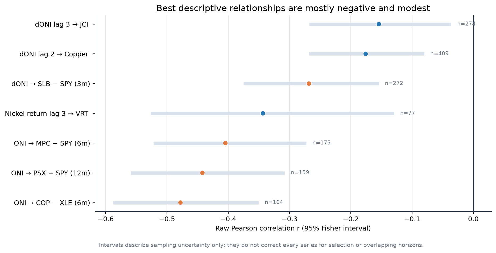
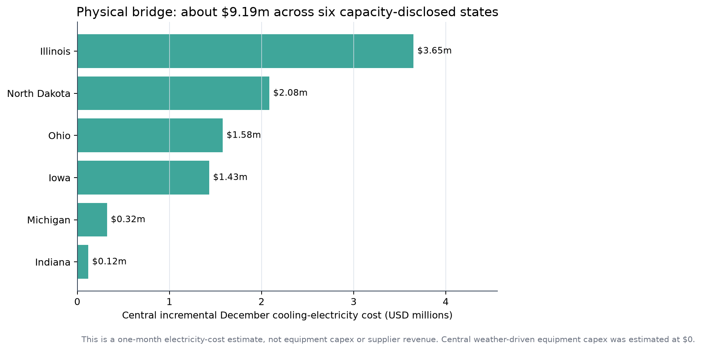
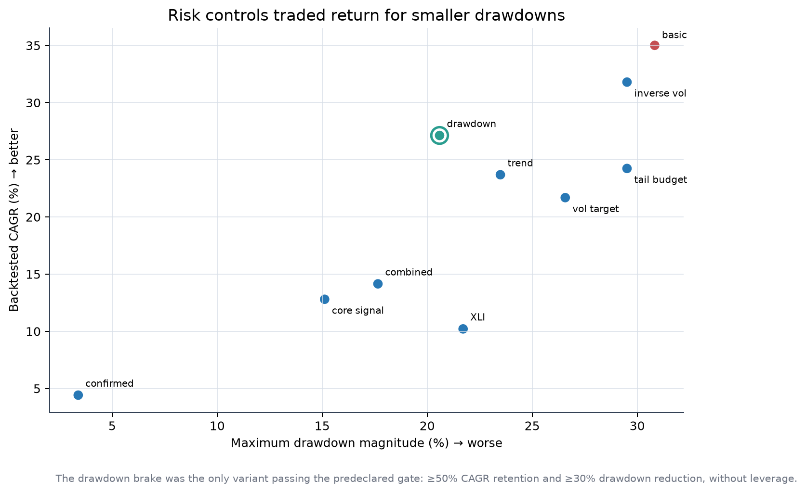

# ENSO cross-asset research

## From a climate forecast to a costed, point-in-time portfolio test

This repository records the complete research path from a September 2026 El Niño forecast to tests in insurance, agriculture, metals, energy, data-center cooling equities, options and portfolio risk controls. It is written as a decision document: every hypothesis is stated before its result, the estimation method is identified, and a positive historical result is separated from evidence that the signal can be traded.

**Bottom line:** ENSO is useful as a slow state variable and scenario input. In this sample it is **not a sufficiently validated stand-alone equity alpha**. The strongest descriptive relationship was ONI versus the six-month COP–XLE relative return, but the event-driven implementation had only two independent trades. The data-center work found a plausible December electricity-cost effect, not a credible ENSO-driven equipment-order shock. The investable cooling basket earned strong historical returns, yet most of that result is more plausibly broad AI/data-center capital spending, equity beta and universe selection than climate timing. The only portfolio overlay that passed the predeclared risk/return gate was a simple drawdown brake; that result is still in-sample.

> This is historical research, not investment advice. No orders were sent. Returns are sample-dependent, taxes are simplified where modeled, and several market series exclude dividends or true historical bid–ask conditions.

**Run the code:** see the [repository runbook](RUNBOOK.md) for environment setup,
offline execution order, every analysis command, tests, outputs and troubleshooting.

## Research map



The ordering matters. A statistically interesting asset correlation does not validate the physical chain that supposedly causes it, and a plausible physical chain does not prove that the associated equity return is unpriced.

## Executive hypothesis register

| ID | Hypothesis | Main estimation | Result | Research decision |
|---|---|---|---|---|
| H0 | Seasonal models can estimate late-2026 ONI and state effects | Ensemble calibration, blocked validation, state-temperature regression | Forecast useful for scenarios but outside training maxima; September/October state skill not demonstrated | **Scenario input only** |
| H1 | ENSO predicts insurer losses through catastrophe exposure | Delayed ENSO correlations, conditional probabilities, probability calibration | Insurance-basket next-month return correlation `r = -0.013`; probability model underperformed the unconditional rate | **Reject as stand-alone signal** |
| H2 | ENSO predicts agricultural assets | Delayed correlations and costed fund overlays | Several modest correlations; DBA overlay CAGR 3.91% versus 5.68% always invested | **Reject current implementation** |
| H3 | ONI changes predict metal returns | Lag sweep followed by expanding walk-forward selection | Copper was closest to usable; HAC `p = 0.073`, IC `p = 0.129`; aluminum and nickel failed | **Weak research lead** |
| H4 | Metal returns predict cooling-infrastructure stocks | Lagged correlation and walk-forward test | VRT showed 42.4% annualized return, but only 17 months; IC `p = 0.911` | **Not validated** |
| H5 | ONI predicts relative energy-company returns | HAC regressions, multiple-testing correction and peak event study | COP–XLE six-month `r = -0.478`, BH `q = 0.003`; no event-study or strategy mean survived | **Best correlation lead, not a strategy** |
| H6 | Strong positive ENSO signals can trade COP against XLE | Five fixed rules, seven horizons, walk-forward direction selection | Best rule returned 3.08% after simplified tax from two trades in one episode | **Insufficient independent events** |
| H7 | Options improve the COP/XLE signal | Historical contract selection and exact-bar debit P&L | COP ATM puts returned 8.34% after tax on initial capital; two trades and no historical IV surface | **Convexity lead, unvalidated** |
| H8 | Forecast state warming raises data-center cooling cost | PUE sensitivity × capacity × hours × local electricity rate | Central December cost +$9.19m across six disclosed states | **Plausible operating-cost scenario** |
| H9 | The same forecast causes incremental 2026 cooling-equipment capex | Design-temperature, lead-time and procurement screen | Central identifiable weather-driven capex = $0; contingency screen is not committed spend | **Reject near-term event-capex thesis** |
| H10 | ONI/temperature/metals can forecast cooling-stock prices | Ridge factor model plus residual block Monte Carlo | Climate scenario spread was small beside market and residual risk; one model had negative OOS `R²` | **Stress tool, not target prices** |
| H11 | A confirmed ENSO + cooling + news signal improves the cooling basket | Delayed ONI surprise, cooling proxy, lagged news, momentum and beta hedge | 4.42% CAGR, −3.38% max drawdown, HAC `p = 0.308`; only eight active months | **Risk satellite only** |
| H12 | Monthly long straddles monetize ENSO uncertainty | Historical ATM selection, capital constraint and explicit option costs | Most tickers lost money; one-contract shadow results were also negative | **Reject** |
| H13 | Peak El Niño plus short/order-book/ATR features trades insurers | Fixed daily composite, next-open execution, 2.5× ATR stop | Enhanced strategy −21.9% versus passive insurance basket +481.4% in selected windows | **Reject** |
| H14 | Portfolio controls improve the cooling basket’s loss profile | Capped inverse vol, vol target, trend, drawdown, ES, hedge and fixed sleeve tests | Drawdown brake retained 77.5% of basic CAGR and reduced max drawdown 33.2% | **Only policy passing the in-sample gate** |

“Reject” means the tested implementation did not earn promotion. It does not prove that no ENSO effect exists in the asset class.

The machine-readable experiment ledger is available in [`enso_experiment_record.csv`](enso_experiment_record.csv). It separates model variants, strategy implementations and risk-policy comparisons into 47 records.

---

## 1. Initial El Niño estimation

### 1.1 Question

Given information available on 11 September 2026, what ONI values were consistent with the Copernicus seasonal ensembles for September–December 2026, and which US states had an estimated ENSO-associated temperature contribution above +2°C?

The first deliverable is the [seasonal forecast report](enso_forecast_2026/ENSO_forecast_September_December_2026.html). It is a research calibration, not an official NOAA forecast.



### 1.2 External data

This stage used no equity-price data.

| Input | Purpose | Local evidence | External source |
|---|---|---|---|
| Copernicus seasonal monthly ensembles and hindcasts | Niño 3.4 SST forecast from ECMWF system 51, DWD 22 and CMCC 4 | [`raw/*.nc`](enso_forecast_2026/raw/) and [`requests/`](enso_forecast_2026/requests/) | [Copernicus CDS seasonal data](https://cds.climate.copernicus.eu/datasets/seasonal-monthly-single-levels) |
| ERA5 monthly fields | Recent SST and temperature context | [`era5_pacific_2026.nc`](enso_forecast_2026/raw/era5_pacific_2026.nc) | [ERA5 monthly means](https://cds.climate.copernicus.eu/datasets/reanalysis-era5-single-levels-monthly-means) |
| NOAA CPC ONI, ERSSTv6 | Observed ONI target | [`oni_v6.html`](enso_forecast_2026/raw/oni_v6.html) | [NOAA current ONI](https://www.cpc.ncep.noaa.gov/products/analysis_monitoring/enso/oni/v6/) |
| NOAA CPC ONI, ERSSTv5 | Definition/version sensitivity | [`oni_v5.html`](enso_forecast_2026/raw/oni_v5.html) | [NOAA ONI archive](https://www.cpc.ncep.noaa.gov/products/analysis_monitoring/enso/oni/v5/) |
| NOAA monthly Niño indices | Independent SST diagnostic | [`monthly_sstoi.txt`](enso_forecast_2026/raw/monthly_sstoi.txt) | [NOAA monthly Niño indices](https://www.cpc.ncep.noaa.gov/data/indices/sstoi.indices) |
| NOAA NCEI state and climate-division temperature | State response estimation | [`state_temperature.txt`](enso_forecast_2026/raw/state_temperature.txt), [`division_temperature.txt`](enso_forecast_2026/raw/division_temperature.txt) | [NOAA climate divisions](https://www.ncei.noaa.gov/pub/data/cirs/climdiv/) |
| NOAA ENSO discussion | Contemporary regime context | [`enso_discussion.html`](enso_forecast_2026/raw/enso_discussion.html) | [NOAA ENSO discussion](https://www.cpc.ncep.noaa.gov/products/analysis_monitoring/enso_advisory/ensodisc.shtml) |

Every downloaded source has a recorded request, version or SHA-256 hash in [`download_manifest.jsonl`](enso_forecast_2026/download_manifest.jsonl), [`versions.json`](enso_forecast_2026/versions.json) and [`raw_sha256.json`](enso_forecast_2026/raw_sha256.json).

### 1.3 Estimation

For season (s), ONI is the three-month mean Niño 3.4 anomaly:

$$
ONI_s=\frac{1}{3}\sum_{m\in s}(SST_{3.4,m}-\overline{SST}^{clim}_{3.4,m}).
$$

Each model’s hindcast SST was converted to the same Niño 3.4 seasonal target. A ridge calibration mapped raw model forecasts into observed ONI:

$$
\hat y=X\hat\beta,\qquad
\hat\beta=\arg\min_\beta \left\{\|y-X\beta\|_2^2+\alpha\|\beta\|_2^2\right\}.
$$

The penalty was selected on 2003–2016 tuning data. The final choice was CMCC with (alpha=0.1). Evaluation used the 2017–2025 holdout excluding 2024, preventing the final forecast month from entering the validation score.

| Model | Holdout RMSE | Interpretation |
|---|---:|---|
| ECMWF | 0.273°C | Best reported holdout RMSE |
| CMCC, selected by tuning | 0.294°C | Final calibrated model |
| Persistence | 0.566°C | Naive comparator |

The selected model was not the ex-post best holdout model. That is appropriate if the tuning rule was fixed, but it also warns that model rankings are close and sample-dependent.

### 1.4 Forecast result

| Target month / season | Median ONI | 80% interval |
|---|---:|---:|
| September / ASO | +2.6°C | +2.4 to +2.9 |
| October / SON | +3.0°C | +2.6 to +3.5 |
| November / OND | +3.3°C | +2.8 to +3.9 |
| December / NDJ | +3.5°C | +2.9 to +4.1 |

The latest observed JJA 2026 ERSSTv6 ONI in the saved dataset was +1.8°C. All four forecast targets exceeded their training-sample maxima. This is extrapolation, so uncertainty bands should not be interpreted as guaranteed frequentist coverage in the tail.

### 1.5 State-temperature translation

For each state and calendar month, temperature was regressed on ONI with historical seasonality separated. The reported quantity is the **estimated ENSO-associated contribution**, not the total weather anomaly and not a causal structural coefficient.



Eleven states exceeded +2°C in the December central estimate: North Dakota, Minnesota, Wisconsin, South Dakota, Iowa, Michigan, Illinois, Indiana, Ohio, Montana and New York. The largest estimates were North Dakota +4.0°C and Minnesota +3.9°C.

### 1.6 What could go wrong

- The forecast is outside the range used to fit the calibration.
- September and October state-level added skill was not demonstrated in validation.
- Current hindcasts are modern reconstructions, not necessarily the forecast systems an investor would have received in each historical year.
- NOAA historical ONI observations can be revised. A current downloaded series is not a vintage archive.
- State regressions average large geographic areas; data-center sites experience local weather.
- ENSO is one weather driver among many. A state effect cannot be read as the realized temperature.

**Decision:** carry the forecast forward as a scenario variable, while imposing a publication delay in historical simulations. Do not treat the central path as certain.

---

## 2. Point-in-time data design

### 2.1 The timing rule

An ONI value is centered on a three-month season and is unavailable before the season is complete. The historical work therefore shifts the signal by two or three months, depending on the test, and freezes every fitted choice before the return interval.



No test-period return may choose its own lag, sign, asset, threshold or stop. When a true vintage archive was unavailable, the report labels the delayed revised series as an approximation rather than point-in-time truth.

### 2.2 External exogenous data versus market data

The research deliberately separates two layers:

1. **External exogenous data:** NOAA/Copernicus climate observations and forecasts, NOAA state temperature, EIA electricity rates, LBNL capacity/energy research, ASHRAE/JLL engineering and procurement research, public operator disclosures, issuer filings and public Yahoo futures quote histories.
2. **Locally cached market data:** stock, ETF, option, short-interest, short-volume and quote files that had already been downloaded. The current master build makes **no Massive API calls and reads no API key**.

This distinction matters. A result is not independently replicated merely because climate data come from NOAA; the return side can still have vendor coverage, adjustment and survivorship limits.

### 2.3 Data matrix by hypothesis

| ID | External/non-Massive inputs | Market-data layer used in the saved test | Coverage that matters | Main data limit |
|---|---|---|---|---|
| H0 | Copernicus seasonal ensembles/hindcasts; ERA5; NOAA ONI/SST; NOAA state temperatures | None | Hindcasts from 1993/2003 by system; forecast initialized in 2026 | Modern hindcasts and current ONI are not a full historical vintage archive |
| H1 | [NOAA weekly Niño 3.4](https://www.cpc.ncep.noaa.gov/data/indices/wksst9120.for), [NOAA ONI](https://www.cpc.ncep.noaa.gov/data/indices/oni.ascii.txt), NOAA hurricane mechanism | Cached adjusted RNR, EG, ACGL and SPY histories | 239 complete months in the main overlap | Three current insurers are not a historical industry universe |
| H2 | NOAA ENSO plus cached public Yahoo futures quote histories | Cached DBA, CORN, SOYB and WEAT fund bars for costed tests | Quote histories generally Sep 2006–Sep 2026 | Quote paths lack verified contract/roll identity; funds add roll and fee effects |
| H3 | User-supplied aligned NOAA ONI/benchmark-metal CSV | Copper, aluminum and nickel benchmark series embedded in that file | About 409 monthly pairs; walk-forward begins 2002 | Upstream metal-price provenance was not reconstructed in the master audit |
| H4 | Same ONI/metal file | Cached MOD, VRT, JCI, ETN and other equity bars | VRT OOS test has only 17 months | Young listings and current-name selection |
| H5 | NOAA ONI/ΔONI | Cached energy-company, XLE and SPY bars | 159–272 monthly rows; seven eligible peaks | Overlapping horizons create fewer independent observations than rows |
| H6 | NOAA ONI with a two-month embargo | Cached COP and XLE daily bars and distributions | 2020–2026; best rule has two trades | One completed strong episode and 35 rule/horizon comparisons |
| H7 | Same frozen NOAA signal | Cached point-in-time option chains and exact option bars | Two eligible entries | No independent historical IV surface, Greeks or executable NBBO reconstruction |
| H8 | NOAA state effects, EIA rates, LBNL energy research, Lau–Tsai state capacity | None | December 2026; six states with separately disclosed capacity | Site load/utilization/PUE are modeled rather than observed |
| H9 | NOAA temperatures, ASHRAE/JLL engineering research, operator disclosures and supplier filings | Cached supplier equity diagnostics only as context | Forecast lead time versus 2026 procurement evidence | Public disclosures do not identify every site-level vendor award |
| H10 | NOAA ONI/state temperature and the aligned metal file | Cached monthly cooling-stock and XLI bars | 77–270 months by ticker | Short VRT history; scenario factors are not calibrated joint probabilities |
| H11 | NOAA/metal/state inputs plus cached issuer news text | Cached monthly stock/XLI bars | Jun 2021–Aug 2026; eight active signal months | News coverage sets a short common start and the universe is selected with present knowledge |
| H12 | NOAA ONI and public HK personal-tax guidance used only for framing | Cached option chains, option bars, underlying bars and FX | Apr–11 Sep 2026 | Thin option volume, incomplete final holding period and no IV surface |
| H13 | NOAA ONI; user-supplied insurer universe/screenshot | Cached stocks, KIE/SPY, short interest, short volume and NBBO quotes | Prices vary by listing; short volume begins Feb 2024 | Severe alt-data sparsity, dividends excluded and survivor bias |
| H14 | Prior external climate/metal/state inputs remain upstream | Same cached seven-stock/XLI monthly panel | 63 months, Jun 2021–Aug 2026 | Tail statistics contain only a few monthly losses and thresholds are in-sample |

### 2.4 Common cleaning rules

- Parse timestamps in UTC, convert to the relevant exchange date, then aggregate.
- Sort and deduplicate by instrument and timestamp before returns are calculated.
- Use adjusted equity bars where available; explicitly state when dividends are excluded.
- Use adjacent complete months for monthly log returns: (r_t^{log}=\log(P_t/P_{t-1})).
- Do not forward-fill missing market prices into a return interval.
- In the insurance/agriculture study, require at least 15 daily observations, a first observation by day 7 and a last observation on or after day 25 for a complete month.
- Reject daily returns spanning more than seven calendar days and remove known weekend placeholders.
- Keep signal timestamps distinct from economic observation timestamps.
- Shift news and alternative data by their assumed reporting delay before joins.
- For options, retain the exact contract, strike, expiration, entry bar and exit bar; do not splice options with different terms.
- Do not call an unidentified nearby-futures quote path “tradable.” Contract rolls can create price jumps unrelated to spot returns.

### 2.5 Walk-forward template

At decision date (t):

1. Form a training sample using only rows with information dates (le t).
2. Estimate candidate lags/specifications on that sample.
3. Select one specification under the predefined rule.
4. Freeze it for the next test block.
5. Apply transaction costs and any tax convention to the realized test return.
6. Advance to the next training date and repeat.

This is stricter than computing one full-sample correlation and applying it retroactively, but it is not automatically unbiased if the researcher tried many complete strategies and reported only the best.

---

## 3. First cross-asset conclusions: insurance and agriculture

Full report: [ENSO, insurance and agriculture](enso_study/ENSO_insurance_agriculture_research.html).

### 3.1 H1 — insurer equities

**Hypothesis.** El Niño changes catastrophe risk, claims and pricing conditions, which should alter subsequent insurer returns or volatility.

**External inputs.** NOAA weekly Niño 3.4 contained 2,349 observations from September 1981 through 2 September 2026; NOAA ONI contained 919 seasonal records. NOAA’s [Atlantic-hurricane mechanism](https://www.aoml.noaa.gov/how-does-el-nino-impact-atlantic-hurricane-season/) supports a physical link through vertical wind shear, not an equity-return forecast.

**Market universe.** RNR, EG and ACGL formed an equal-weight insurer basket; SPY was a broad benchmark. This small current-name universe is not a historical industry panel.

**Estimation.** The study measured delayed ENSO versus next-month return and realized volatility, calculated warm/neutral/cold conditional loss rates, estimated controlled correlations, and evaluated a defensive overlay from 2017 onward. A year-block bootstrap respected some within-year dependence. The probability model was compared with the unconditional decline probability using Brier skill.

**Result.** The insurance-basket ENSO/next-month-return correlation was `−0.013` across 239 months. The fitted decline model had Brier skill of about `−0.035`, meaning it was worse than always using the unconditional decline rate. The defensive overlay earned 10.37% CAGR versus 11.49% always invested and 10.99% for a comparator with the same average exposure. Maximum drawdown remained about −35.5%.

**Why it failed.** ENSO is far from insurer earnings. Results also depend on regional exposure, reinsurance, premium repricing, reserve releases, investment income, rates and what investors already expected. The overlay mainly reduced exposure; the equal-exposure comparator showed little timing value.

### 3.2 H2 — agriculture

**Hypothesis.** ENSO affects crop weather and therefore agricultural futures or futures-based funds.

**External market input.** Sixteen public Yahoo futures quote histories—corn, soybeans, wheat, rice, coffee, sugar and related contracts—were cached for descriptive work, generally from September 2006 through September 2026. Examples: [corn](https://finance.yahoo.com/quote/ZC=F/history/), [soybeans](https://finance.yahoo.com/quote/ZS=F/history/) and [wheat](https://finance.yahoo.com/quote/ZW=F/history/).

**Practice.** The quote histories were used for correlation and volatility descriptions only. The costed strategy used futures-based funds such as DBA, CORN, SOYB and WEAT because the available futures paths did not preserve verified contract identity and roll transactions. Fund methodology introduces its own roll rules and fees: see [DBA](https://www.invesco.com/content/dam/invesco/us/en/product-documents/etf/fact-sheet/dba-invesco-db-agriculture-fund-fact-sheet.pdf) and [Teucrium agricultural funds](https://teucrium.com/agricultural-commodity-etfs).

**Result.** The broad quote basket had a contemporaneous ENSO/next-month-return correlation near `−0.133`. The DBA defensive overlay earned 3.91% CAGR versus 5.68% always invested. Results varied by commodity and ENSO definition.

**Why it failed.** Regional crop exposure, planting calendar, inventories, currency, contract curve and government policy dilute a global SST index. Stitched nearby quotes are not executable returns, and fund returns combine commodity exposure with rolling and fees.

**Decision for H1–H2:** neither passed the baseline of stable sign, incremental performance versus a same-exposure control, and credible execution data.

---

## 4. ONI → metals → cooling infrastructure

Full report: [walk-forward metals and cooling infrastructure](enso_metals_walkforward/ENSO_metals_cooling_walkforward_report.html).

### 4.1 H3 — ONI to metals

The initial lag sweep found:

| Relationship | Descriptive `r` | Raw `p` | Months |
|---|---:|---:|---:|
| ΔONI lag 2 → copper | −0.176 | 0.00036 | 409 |
| ΔONI lag 2 → aluminum | −0.153 | 0.00194 | 409 |
| ΔONI lag 8 → nickel | +0.100 | 0.0440 | 405 |

These are hypothesis-generation results. They use the user-supplied aligned ONI/benchmark-metal file; the upstream benchmark-price vendor was not independently reconstructed in this master audit.

The stricter test used expanding training data, selected a lag/specification using only the training sample, imposed a two-month ONI delay plus a one-month gap, and traded the following frozen 12-month block.

| Asset | OOS months | Annualized return | Sharpe | Max drawdown | HAC `p` | IC / IC `p` |
|---|---:|---:|---:|---:|---:|---:|
| Copper | 292 | 8.32% | 0.48 | −49.63% | 0.073 | +0.089 / 0.129 |
| Aluminum | 292 | 1.24% | 0.16 | −74.36% | 0.519 | −0.036 / 0.537 |
| Nickel | 292 | −14.81% | −0.41 | −98.70% | 0.096 | −0.164 / 0.005 |

Copper was the only marginal lead. Even there, the return mean and forecast IC were not significant at 5%, and the drawdown was too large for an unscaled implementation.

### 4.2 H4 — metals to cooling equities

The best descriptive stock relationship was nickel return lag 3 versus VRT next-month return, `r = −0.343`, raw `p = 0.0022`, `n = 77`.



The often-misread VRT row was:

| Asset | Start | End | OOS months | OOS IC | Annualized return | Sharpe | Max drawdown | HAC `p` | Modal rule |
|---|---|---|---:|---:|---:|---:|---:|---|
| VRT | 2025-03 | 2026-07 | 17 | −0.029 | 42.4% | 0.87 | −25.3% | 0.082 | Nickel return lag 3 |

Precisely:

- `42.4%` is an annualized return from 17 monthly observations, not a 42.4% correlation and not a multi-cycle estimate.
- `0.87` is the zero-cash-rate annualized Sharpe.
- `−25.3%` is the worst peak-to-trough decline in that short test.
- HAC `p = 0.082` does not reject a zero mean at 5%.
- The OOS information coefficient was `−0.029` with `p = 0.911`, so the frozen signal had essentially no rank/linear forecasting relation to the next return.
- The 17 months form only two frozen blocks. A high annualized return can coexist with no reliable signal if a few positions happened to earn large returns.

**What went wrong.** The descriptive lag was selected from many candidates; several infrastructure stocks had very short histories; chosen lags changed across training windows; the revised ONI archive remained an approximation; and large market/thematic returns dominated the small climate/metal signal.

**Decision:** no contract-level futures strategy was claimed because the retained data did not provide a verified, expiration-specific history adequate for the requested test.

---

## 5. ONI and US energy equities

Reports: [energy correlation and peak study](enso_energy_peaks/El_Nino_peaks_US_energy_backtest.html) and [cross-strategy correlation comparison](strategy_correlation_comparison/raw_correlation_strategy_comparison.html).

### 5.1 H5 — relative energy returns

Universe: XOM, CVX, COP, EOG, OXY, SLB, MPC, PSX, KMI, WMB and XLE, with SPY/XLE relative-return controls. Seven eligible historical El Niño peaks were identified. Predictive regressions used HAC standard errors because multi-month forward returns overlap.



| Relationship | Horizon | `r` | Raw `p` | BH `q` | `n` |
|---|---:|---:|---:|---:|---:|
| ONI → COP − XLE | 6m | −0.478 | 0.000018 | 0.0031 | 164 |
| ONI → PSX − SPY | 12m | −0.442 | 0.000531 | 0.0389 | 159 |
| ONI → MPC − SPY | 6m | −0.405 | 0.000906 | 0.0389 | 175 |
| ΔONI → SLB − SPY | 3m | −0.268 | 0.00201 | 0.0441 | 272 |

Nine of 168 predictive tests survived global Benjamini–Hochberg `q < 0.05`. No peak event-study result and no strategy mean survived the same standard.

#### Why a near-zero p-value can still be a bad strategy

For a null (H_0:\rho=0), the p-value is the probability—under the null and the model assumptions—of observing a statistic at least as extreme as the one obtained. It is **not**:

- the probability the hypothesis is false;
- the probability the trade will profit;
- the size of the expected return;
- protection against an omitted common driver;
- proof that the chosen horizon was known before testing;
- evidence that a signal survives costs or another market regime.

Thus `p ≈ 0` for ONI–COP/XLE means the historical regression is inconsistent with a zero slope under its assumptions. The correlation is negative: higher ONI was associated with weaker COP relative to XLE over the next overlapping six months. It does not say “buy XLE now,” and it does not solve the event-count problem.

Conversely, **a high p-value is not desirable evidence**. A `p > 0.50` result normally means the sample provides little reason to distinguish the estimated relation from zero. Keeping companies with the highest p-values would invert statistical inference. Candidate ranking should combine effect size, uncertainty, stability, point-in-time validity and implementation cost.

#### Raw magnitude

“Raw magnitude” means (|r|), the absolute sample correlation. It ignores sign and units. It is not beta:

$$
\beta_{Y,X}=r_{Y,X}\frac{\sigma_Y}{\sigma_X}.
$$

The native-horizon ranking favored COP–XLE at (|r|=0.478), but multi-month overlapping returns are smoother and not directly comparable with one-month targets. At a common one-month horizon, nickel→VRT ranked first at (|r|=0.343), followed by ΔONI→PSX−XLE at 0.215, copper at 0.176 and JCI at 0.154. The VRT sample was much shorter.

### 5.2 Peak-confirmation strategy

Some post-peak cumulative returns were large—PSX +76.7% and COP +57.3%—but each had only two out-of-sample peak events and mean-return p-values of 0.162 and 0.182. SLB and XLE lost 53.5% and 37.1% in their tested implementations.

**Why the correlation did not become a strategy.** Overlapping forward returns create many rows but not many independent El Niño episodes. COVID, oil-price cycles, refining margins, company operations and broad equity regimes coincide with the climate states. Event confirmation also arrives after part of any repricing.

---

## 6. Strong-event COP/XLE trading and options

### 6.1 H6 — walk-forward pair trade, 2020–2026

Full report: [COP/XLE strong-El-Niño walk-forward](enso_cop_xle_strong_event_walkforward/COP_XLE_strong_El_Nino_walkforward_report.html).

The strategy tested only positive strong El Niño states. Five fixed signal definitions and seven return horizons—1, 2, 5, 10, 20, 40 and 60 trading days—were evaluated. The information set used a two-month embargo, and trade direction could be learned only from earlier completed signals.

The best ex-post rule was “strong but cooling” at 40 trading days:

| Trades | Gross return | Net pre-tax | After simplified 37% tax | Max closed-trade drawdown | Win rate |
|---:|---:|---:|---:|---:|---:|
| 2 | 5.30% | 4.89% | 3.08% | −1.73% | 100% |

The pair return was (0.5r_{XLE}-0.5r_{COP}): 100% gross and approximately zero initial net equity exposure. Costs were 10 bp per order, or 20 bp round trip. The two trades occurred in one 2023–2024 episode and in the same broad regime. Selecting the winner from 35 rule/horizon combinations creates a material selection penalty.

XLE buy-and-hold earned much more over the full 2020–2026 interval, but that is not an exposure-matched benchmark. XLE returned −3.22% during the pair strategy’s actual windows, which is the more relevant window comparison.

### 6.2 H7 — options adaptation

Full report: [COP/XLE options adaptation](enso_options_adaptation/ONI_COP_XLE_options_adaptation_report.html).

Contracts were selected from the historical chain available at each entry: nearest listed strike to spot, expiration at least seven days after planned exit, and closest to 75 days to expiry. Entry and exit used the exact option bars. The maximum debit was 10% of initial capital.

Best tested structure: long COP at-the-money put.

| Trades | Capital deployed | Raw P&L | Friction | Net pre-tax | After-tax return on initial capital | Return on deployed debit |
|---:|---:|---:|---:|---:|---:|---:|
| 2 | $20,116 | $14,651 | $1,406 | $13,245 | 8.34% | 65.84% |

The convex put matched the realized COP downside while limiting premium at risk. Other structures did not transfer: the XLE call/COP put pair was slightly negative after tax, the XLE bull spread lost 11.4%, and the long XLE call lost 12.7%.

**Critical omissions.** The study did not reconstruct historical implied-volatility surfaces, Greeks, intraday spreads or executable quote depth. It applied a deliberately heavy 2.5% haircut to each option transaction plus $0.65 per contract per leg. Two trades cannot distinguish skill from a favorable path.

**Decision:** the put is a candidate payoff shape, not a validated forecast. A proper next test needs a longer point-in-time option surface and nested model selection.

---

## 7. The physical data-center cooling chain

Reports: [state cooling-electricity estimate](enso_datacenter_cooling_2026/ENSO_2026_datacenter_cooling_spend.html) and [capex/supplier research](enso_datacenter_cooling_capex_2026/ENSO_2026_cooling_capex_supplier_research.html).

### 7.1 H8 — incremental cooling electricity

The estimate was restricted to December states with central ENSO contribution above +2°C. Absolute dollars were calculated only for Illinois, Indiana, Iowa, Michigan, North Dakota and Ohio because these six states had separately disclosed data-center capacity in the cited capacity study. Other states were reported per 100 MW only.

For facility capacity (C), hours (h), utilization (u), and incremental PUE component (\Delta PUE):

$$
\Delta E_{MWh}=C_{MW}\times h\times u\times\Delta PUE,
$$

$$
\Delta Cost=\Delta E_{MWh}\times ElectricityRate_{USD/MWh}.
$$

Central assumptions were 744 December hours, 70% utilization, base PUE 1.30, base cooling component 0.24, and (\Delta PUE/\Delta T=0.015) per °C. Low and high sensitivities were 0.0075 and 0.030.



Across the six disclosed states, the central incremental December cost was **$9.19m**, with a sensitivity range of **$2.19m to $28.59m**. This is an operating-electricity estimate for one month. It is not a balance-sheet equipment asset, a vendor order or a supplier revenue forecast.

External inputs included:

- [EIA Electric Power Monthly table 5.6.A](https://www.eia.gov/electricity/monthly/epm_table_grapher.php?t=epmt_5_6_a) for June 2026 state commercial rates;
- [LBNL US Data Center Energy Usage Report](https://eta-publications.lbl.gov/sites/default/files/2024-12/us_data_center_energy_usage_report_lbnl-2001637_0.pdf) for energy/PUE context;
- [Lau and Tsai, 2026](https://doi.org/10.1021/acs.energyfuels.6c01309) for state capacity estimates;
- the stored ENSO/state forecast from Section 1.

### 7.2 H9 — new equipment capex and supplier revenue

The next question was whether a warmer 2026 winter forces operators to buy additional cooling equipment. The central answer was **approximately $0 of identifiable ENSO-driven new-equipment capex**.

Why:

- Even after the modeled warming, most northern-state December means remained cool enough for economization/free cooling.
- Design capacity is normally set by hot design conditions and rack density, not by a three-month winter forecast.
- JLL’s cited procurement lead time was about 33 weeks, longer than the 12–16 week forecast window.
- Operators and suppliers were already adapting to AI rack density, liquid cooling, water limits and efficiency before the climate signal.

A hypothetical audit/contingency screen totaled $5.80m centrally across the six disclosed states, with a $2.34m–$28.13m range. It is a screening allowance, **not committed capex**. By comparison, the estimated 2025–2030 cooling basis linked to the broader capacity pipeline was about $59.97bn. The secular buildout dominates the event increment.

The public supplier screen included MOD, AAON, VRT, NVT, JCI, TT, SPXC, FIX and EME. Sources included [ASHRAE’s AI data-center thermal framework](https://www.ashrae.org/technical-resources/ai-data-center-framework/energy-and-thermal-efficiency), [JLL’s 2026 data-center outlook](https://www.jll.com/content/dam/jllcom/en/global/documents/reports/research-reports/26-research-global-data-center-outlook.pdf), public operator disclosures from Microsoft, Meta and Google, and issuer filings/order announcements. No state-level vendor award was invented when a public match was unavailable.

**Was adaptation already done?** The evidence says largely yes for the secular requirement: company order/backlog announcements and operator cooling designs preceded the September ENSO signal. That does not mean every site was fully protected, but it makes a sudden ENSO-specific revenue surprise unlikely.

---

## 8. Cooling-company price scenarios and the confirmed strategy

### 8.1 H10 — October–December Monte Carlo

Full report: [cooling-stock Monte Carlo](datacenter_cooling_monte_carlo_2026/datacenter_cooling_stock_monte_carlo_oct_dec_2026.html).

Universe: MOD, AAON, VRT, NVT, JCI, TT and SPXC, plus an equal-weight basket. Monthly stock log returns were fit with ridge models using XLI, copper, aluminum, nickel, ONI, ΔONI and a Midwest-temperature factor. Residuals were resampled in three-month blocks. There were 27 ONI × temperature × metals scenario cells and 10,000 paths per cell; the historical intercept was set to zero to avoid mechanically extending the prior rally.

For stock (i):

$$
r_{i,t}=\beta_i^\top X_t+\varepsilon_{i,t},
$$

with (\beta_i) estimated by ridge regression and (\varepsilon) sampled in contiguous blocks to preserve some short-run dependence and cross-company covariance.

Central scenario:

| Asset | Median Oct–Dec return | 5th percentile | 95th percentile | OOS `R²` |
|---|---:|---:|---:|---:|
| Equal basket | +4.62% | −20.67% | +26.34% | — |
| VRT | +19.25% | −28.38% | +76.16% | 0.122 |
| MOD | +9.40% | — | — | 0.386 |
| AAON | approximately 0% | — | — | 0.230 |
| NVT | −0.09% | — | — | −0.498 |
| JCI | −2.55% | — | — | 0.480 |
| TT | +2.62% | — | — | 0.352 |
| SPXC | −5.04% | — | — | 0.443 |

The basket’s median varied only about +2.8% to +7.0% across all 27 cells, far less than the residual/market range. NVT’s negative blocked OOS `R²` means the model forecast was worse than a holdout mean comparator. The output is therefore a conditional risk fan, not a set of price targets.

### 8.2 Was El Niño priced in?

The saved news archive contained zero explicit ENSO mentions for the cooling names, while AI, orders, backlog, capacity and cooling appeared frequently. The reasonable inference is:

- the specific ENSO label was not a dominant disclosed narrative;
- the economically larger secular cooling expansion was already highly visible;
- absence of the term “ENSO” does not prove that weather expectations were absent from prices;
- mixed stock responses around ENSO news dates do not support a common event repricing.

### 8.3 H11 — confirmed climate/equity signal

Full report: [confirmed strategy and scenarios](enso_cooling_confirmed_strategy_2026/confirmed_enso_cooling_strategy_report.html).

The improved strategy did not trade ONI alone. It required:

- ONI above +0.5°C and rising or positively surprising;
- a rolling AR(1) ONI surprise, delayed three months;
- a capacity-weighted cooling-degree proxy;
- prior-month fundamental news;
- three-month stock return relative to XLI;
- cooling-exposure purity;
- an XLI trend regime;
- at most two stocks, six-month inverse-vol weights and a partial/full XLI beta hedge.

The AR(1) surprise was:

$$
ONI_t=a+\phi ONI_{t-1}+u_t,\qquad z_t=\frac{u_t-\bar u_{past}}{s(u_{past})}.
$$

Only observations before (t) estimated (a), (\phi), the residual mean and its scale.

Backtest, June 2021–August 2026:

| Series | CAGR | Annual vol | Sharpe | Max drawdown | HAC mean `p` | Active months |
|---|---:|---:|---:|---:|---:|---:|
| Confirmed ENSO signal | 4.42% | 7.53% | 0.61 | −3.38% | 0.308 | 8 |
| Naive ONI strategy | 9.19% | 12.89% | 0.74 | −9.99% | 0.246 | more frequent |
| Equal cooling basket | 35.05% | 31.93% | 1.11 | −30.83% | 0.0147 | 63 |
| XLI | 10.21% | 18.33% | 0.62 | −21.71% | — | 63 |

The confirmed signal improved the loss profile by holding cash and hedging, but it did not establish climate alpha: only eight active months, no significant HAC mean and heavy dependence on one completed strong El Niño.

### 8.4 Three forward scenarios

| Scenario | Assumption | Median Oct–Dec strategy return | P10 | P90 |
|---|---|---:|---:|---:|
| Excellent | Cooling spend causes positive equity repricing | +17.14% | −7.48% | +40.98% |
| Normal | No extra ENSO uplift beyond modeled factors | +4.61% | −9.42% | +16.80% |
| Conservative | Climate sleeve remains in cash | 0.00% | 0.00% | 0.00% |

These are conditional definitions, not calibrated probabilities. Six of seven latest forecast models had negative blocked OOS `R²`, so the scenario table should be used for sizing/stress discussion rather than expected-return budgeting.

---

## 9. Long straddles and renewed insurance tests

### 9.1 H12 — data-center infrastructure straddles

Full report: [April–September 2026 straddles](dc_infrastructure_straddles_2026/DC_infrastructure_straddles_Apr_Sep_2026.html).

VRT, MOD, ETN, PWR and GEV were tested with monthly same-strike ATM long straddles, no leverage and HKD 100,000 starting capital per ticker path. A 2.5% option-price haircut was charged on every transaction plus $0.65 per contract per leg side.

| Ticker | Monthly strategy return through 11 Sep | Completed-only return | Main issue |
|---|---:|---:|---|
| VRT | −28.59% | −23.49% | Premium/time decay |
| MOD | −29.39% | −29.39% | Premium/time decay |
| ETN | −63.04% | −67.23% | Large debit losses |
| PWR | −42.08% | −38.79% | Two trades unaffordable |
| GEV | −3.04% | 0.00% | Four of five trades unaffordable |

The ONI-gated subset looked better for VRT and MOD in the available completed samples, but there were only one or two completed gated trades in key comparisons. The one-contract shadow portfolio was negative for every ticker, showing that capital constraints and modeled costs were not the sole cause. Sixteen of 23 selected option legs had minimum volume of five contracts or less.

**Why it failed.** A long straddle requires realized volatility to exceed the volatility embedded in both option premiums plus friction. Correctly anticipating uncertainty is not enough. Thin volume, large debit relative to HKD 100,000 and short holding periods worsened the payoff.

### 9.2 H13a — insurer event study

Full report: [insurance stocks and severe El Niño](insurance_oni_event_study/insurance_ONI_event_study.html).

The supplied universe contained 60 current insurers; 58 had usable bars. Severe El Niño was ONI ≥ +1.5°C, shifted by three months. ROOT had `r = +0.400`, HAC `p = 0.00013`, BH `q = 0.0070`, `n = 69`; PLMR had `r = +0.252`, `p = 0.0021`, `q = 0.0577`, `n = 87`. Each young name had only one completed severe episode plus part of 2026.

The catastrophe/property basket earned +1.45% in severe months versus +0.60% otherwise; the 0.85 percentage-point difference had HAC `p = 0.503`. UVE lost 35.1% in the 2015 episode, while ROOT gained 180.7% in the 2023 episode. There was no common insurer selloff.

### 9.3 H13b — peak-event technical and alternative-data strategy

Full report: [peak El Niño insurance strategy](insurance_peak_strategy/peak_el_nino_insurance_strategy.html).

Universe: ROOT, PLMR, KNSL, MCY, LMND, CINF, PGR, AIZ, AIG, BAP, ALL and HIG. Inputs included 20/60-day moving averages, five-day momentum, ten-session Wilder ATR, short interest, short volume and weekly NBBO imbalance. Trades executed at the next session open, used a 2.5× ATR trailing stop, paid 7.5 bp per side plus 3% annualized short borrow, and applied 20% tax to positive realized event gains.

| Strategy | Linked-period return | Sharpe | Max drawdown | Active hit rate |
|---|---:|---:|---:|---:|
| Passive current-name basket | +481.44% | 0.98 | −37.99% | 54.3% |
| KIE benchmark proxy | +122.71% | 0.56 | −44.72% | 55.3% |
| SPY | +118.96% | 0.64 | −34.10% | 55.6% |
| Enhanced short/order-book | −21.92% | −0.45 | −26.32% | 48.4% |
| Core MA + ATR | −24.75% | −0.31 | −30.12% | 48.6% |

The passive result is not evidence for an ENSO trade. It is highly affected by selecting today’s survivors, young high-growth names and bullish windows. Short interest began only in December 2017, short volume in February 2024, and historical quotes were sparse. The composite overtraded without a stable directional edge, while the ATR stop often converted short-lived price noise into realized losses.

**Decision:** catastrophe exposure should be modeled with event geography, insurer book mix and claims estimates, not a global ONI threshold plus generic technical indicators.

---

## 10. Portfolio construction and risk management

Full report: [cooling strategy risk management](enso_cooling_confirmed_strategy_2026/cooling_strategy_risk_management_report.html). Detailed code rationale: [project README](enso_cooling_confirmed_strategy_2026/README.md).

The basic investable universe is MOD, AAON, VRT, NVT, JCI, TT and SPXC, with XLI as benchmark/hedge. All policy thresholds were fixed before the comparison and use only prior monthly observations.

### 10.1 Controls tested

1. **25% name cap.** Prevents a low estimated volatility from placing more than one quarter of long capital in one issuer.
2. **Capped inverse volatility.** (w_i\propto1/\hat\sigma_i), using 12 prior months; excess above the cap is redistributed.
3. **20% annual volatility target, no leverage.** (g_t=\min(1,0.20/\hat\sigma_{p,t})).
4. **XLI trend scale.** Gross is 100% only when prior XLI is above its six-month mean and has positive three-month return; otherwise 50%.
5. **Shadow drawdown brake.** Gross is 100% above −10% shadow drawdown, 50% from −10% to −20%, and 25% below −20%. A fully observed shadow portfolio determines recovery, avoiding permanent cash lock.
6. **Expected-shortfall budget.** The mean of the worst 10% of the prior 24 shadow returns is compared with an 8% monthly loss budget; gross is scaled down proportionally.
7. **Partial XLI beta hedge.** Hedge 25% of estimated beta in a positive regime and 50% in a weak one. Betas use up to 24 prior months and are clipped.
8. **Most-restrictive combined limit.** Use the minimum of the volatility, trend, drawdown and tail multipliers rather than multiplying them.
9. **Fixed 85/15 core–signal basket.** 85% combined risk-managed core and 15% confirmed ENSO sleeve; the split was not selected from a weight sweep.
10. **Turnover cost.** Charge 15 bp for every one-way unit of long and hedge weight change.

### 10.2 Result



| Policy | CAGR | Annual vol | Max drawdown | CAGR retained | Drawdown reduced | Passed gate? |
|---|---:|---:|---:|---:|---:|---:|
| Basic equal weight | 35.01% | 31.93% | −30.83% | 100.0% | 0.0% | No |
| Inverse volatility | 31.80% | 29.39% | −29.51% | 90.8% | 4.3% | No |
| Volatility target | 21.69% | 22.65% | −26.57% | 62.0% | 13.8% | No |
| Trend scale | 23.69% | 23.33% | −23.48% | 67.7% | 23.8% | No |
| **Drawdown brake** | **27.13%** | **24.12%** | **−20.59%** | **77.5%** | **33.2%** | **Yes** |
| Expected-shortfall budget | 24.24% | 24.85% | −29.51% | 69.2% | 4.3% | No |
| Combined core | 14.15% | 14.99% | −17.65% | 40.4% | 42.7% | No |
| 85/15 core–signal | 12.80% | 13.16% | −15.12% | 36.6% | 50.9% | No |

The predeclared gate required at least 50% of basic-basket CAGR, at least 30% maximum-drawdown reduction and no leverage. The drawdown brake was the only passing policy. This is a policy comparison over 63 months dominated by a large cooling-equity rally, not proof that the thresholds are optimal.

Starting with HKD 100,000, the drawdown-brake path ended at about HKD 352,600 before tax, versus HKD 483,531 for the unprotected basket. The risk reduction cost a material share of upside.

### 10.3 Frozen September 2026 policy state

Using information through August 2026, the shadow drawdown was −17.02%, so the drawdown rule prescribed 50% gross. The audit allocation was:

| MOD | AAON | VRT | NVT | JCI | TT | SPXC | Cash |
|---:|---:|---:|---:|---:|---:|---:|---:|
| 4.88% | 3.95% | 4.54% | 8.76% | 10.10% | 9.40% | 8.37% | 50.00% |

This is a frozen audit record, not a retroactive trade instruction. A live implementation would rebalance only after the stated information cutoff and would need current spread, liquidity, tax and FX checks.

---

## 11. Metric and formula dictionary

This section defines the quantities used across the HTML reports.

### 11.1 Signals and returns

- **ONI:** three-month mean Niño 3.4 SST anomaly, published for overlapping seasons.
- **ΔONI:** (ONI_t-ONI_{t-1}); positive means the index increased from the previous season.
- **Simple return:** (r_t=P_t/P_{t-1}-1). Used for portfolio P&L.
- **Log return:** (\ell_t=\log(P_t/P_{t-1})). Additive through time and used in many regressions.
- **Relative log return:** (\ell^{rel}_{i,t}=\ell_{i,t}-\ell_{benchmark,t}).
- **Pair return:** (r^{pair}_t=w_A r_{A,t}+w_B r_{B,t}), with one weight negative for a short leg.
- **Forward (h)-period return:** (\log(P_{t+h}/P_t)). Adjacent starting dates overlap when (h>1), requiring HAC inference.
- **Signal strength:** usually ONI level, ΔONI, standardized ONI surprise, or predefined strong-event bins. Strength groups were set without reading the future return.

### 11.2 Association and inference

- **Pearson correlation:**

  $$r_{XY}=\frac{\sum_t(X_t-\bar X)(Y_t-\bar Y)}{\sqrt{\sum_t(X_t-\bar X)^2\sum_t(Y_t-\bar Y)^2}}.$$

  It measures linear co-variation from −1 to +1.

- **Raw magnitude:** (|r|). Larger means stronger sample linear association, without direction. It is not expected return or beta.
- **Spearman correlation:** Pearson correlation of variable ranks. It tests monotonic rather than strictly linear association.
- **Partial correlation:** correlation of residuals after both variables are regressed on the same controls, such as calendar month or market return.
- **Fisher correlation interval:** apply (z=\operatorname{atanh}(r)), use standard error (1/\sqrt{n-3}), then transform limits with `tanh`. It assumes independent pairs and is optimistic for overlapping observations unless adjusted.
- **Beta:** (\beta=\operatorname{Cov}(Y,X)/\operatorname{Var}(X)=r\sigma_Y/\sigma_X). Correlation standardizes both series; beta preserves scale.
- **Coefficient of determination:** (R^2=1-SSE/SST). Negative holdout (R^2) means the forecast was worse than the holdout mean comparator.
- **Information coefficient (IC):** correlation between the signal/forecast available at the decision date and the subsequent test return. The report keeps this separate from strategy P&L.
- **HAC/Newey–West test:** estimates coefficient or mean uncertainty with autocovariance terms through lag (L):

  $$\widehat{Var}_{HAC}=\Gamma_0+\sum_{\ell=1}^{L}\left(1-\frac{\ell}{L+1}\right)(\Gamma_\ell+\Gamma_\ell^\top).$$

  It helps with serial correlation and overlapping returns; it cannot create independent El Niño episodes.

- **p-value:** tail probability of the observed statistic under a specified null. It is not the probability that the trading hypothesis is true.
- **Benjamini–Hochberg q-value:** sort (m) p-values and compare (p_{(i)}\le i\alpha/m); adjusted q-values control the expected false-discovery proportion under stated conditions.
- **Block bootstrap:** resample contiguous time blocks or whole years to preserve some serial dependence. Confidence intervals still depend on block length and stationarity.
- **Brier score:** (BS=N^{-1}\sum_t(p_t-y_t)^2), for binary outcome (y_t\in\{0,1\}).
- **Brier skill:** (1-BS_{model}/BS_{baseline}). Negative means worse probability calibration than the baseline.

### 11.3 Strategy performance

For net periodic return (r_t), (N) monthly observations and wealth (W_t=\prod_{j\le t}(1+r_j)):

- **Total return:** (W_N-1).
- **CAGR:** (W_N^{12/N}-1).
- **Annualized volatility:** sample standard deviation of monthly returns × (\sqrt{12}); daily tests use (\sqrt{252}).
- **Sharpe, zero cash rate:** (\bar r/s(r)\times\sqrt{K}), where (K) is periods per year. A zero cash rate understates the value of cash when rates are positive.
- **Sortino, zero target:** (\bar r/s(r_t\mid r_t<0)\times\sqrt{K}).
- **Hit rate:** fraction of active periods or closed trades with positive net return. It ignores payoff size.
- **Drawdown:** (DD_t=W_t/\max_{j\le t}W_j-1).
- **Maximum drawdown:** (min_t DD_t).
- **Drawdown duration:** count of periods from the prior peak until wealth recovers that peak, or until sample end.
- **Calmar:** CAGR divided by absolute maximum drawdown.
- **Empirical 95% VaR:** positive magnitude of the 5th percentile periodic return. It says little about losses beyond that cutoff.
- **Empirical 95% expected shortfall:** positive magnitude of the average return at or below the 5th percentile.
- **Worst three-month return:** minimum compounded return across adjacent three-month windows.
- **Up/down capture:** mean portfolio return divided by mean benchmark return in benchmark-positive/benchmark-negative periods.
- **Portfolio beta:** covariance of portfolio and benchmark returns divided by benchmark variance.
- **Turnover:** (\sum_i|w_{i,t}-w_{i,t-1}|), including hedge changes where stated.
- **Net portfolio return:**

  $$r^{net}_{p,t}=\sum_iw_{i,t}r_{i,t}-h_t r_{bench,t}-c\times Turnover_t.$$

- **CAGR retention:** (CAGR_{policy}/CAGR_{basic}).
- **Drawdown reduction:** (1-|MDD_{policy}|/|MDD_{basic}|).

### 11.4 Event, technical and option metrics

- **Event-window return:** compounded or summed log return from the fixed event entry to exit.
- **Market-relative event return:** event log return minus benchmark log return over the same dates.
- **20-day spike z-score:** ((r_t-\bar r_{20})/s(r_{20})); flags an unusual return relative to the preceding window.
- **True range:** (TR_t=\max(H_t-L_t,|H_t-C_{t-1}|,|L_t-C_{t-1}|)).
- **Wilder ATR:** (ATR_t=((n-1)ATR_{t-1}+TR_t)/n); the insurer strategy used (n=10) trading sessions.
- **ATR stop:** for a long, trail below the running high by (k\times ATR); reverse the sign for a short. The test used (k=2.5).
- **NBBO imbalance:** a signed function of quoted bid/ask size at the sampled quote; it is a quote-state proxy, not executed order flow.
- **Short-volume ratio:** short-marked reported volume divided by total reported volume; it is not short interest.
- **Long-straddle debit:** call entry premium + put entry premium, times contract multiplier and contracts.
- **Option P&L:** exit proceeds − entry debit − modeled haircuts − per-contract fees.
- **Return on deployed debit:** net option P&L divided by premium capital actually deployed. It can be much larger than return on total account capital.
- **Positive-gain tax convention:** (r_{after}=r_{pre}\times(1-\tau)) when realized gain is positive; losses receive no assumed tax credit. This is a simplification, not personal tax advice.

### 11.5 Physical cooling metrics

- **PUE:** total facility energy divided by IT equipment energy. The model isolates a cooling-related PUE component.
- **Cooling-degree proxy:** (CDD=\max(T-T_{base},0)), aggregated with state capacity weights.
- **Incremental cooling energy:** facility capacity × hours × utilization × incremental PUE.
- **Incremental electricity spend:** incremental MWh × state commercial USD/MWh.
- **Contingency capex screen:** capacity × assumed audit/retrofit dollars per 100 MW. It is a planning sensitivity, not observed capex.

---

## 12. What the research process got right—and what should change

### Practices worth keeping

- Separate descriptive correlation, signal-quality IC and realized P&L.
- Align climate data by estimated publication date, not observation label.
- Freeze lags, signs, thresholds and weights before each test block.
- Report benchmark returns over both the full period and the exact strategy windows.
- Charge turnover, option haircuts, borrow and simplified taxes where relevant.
- Correct broad searches for multiple testing and disclose the total tests tried.
- Preserve raw inputs, calculated tables, hashes and failed-access diagnostics.
- Use same-exposure controls so cash timing is not mistaken for forecasting skill.
- Keep physical cost, capex, supplier revenue and stock return as separate links.

### Main failure modes across hypotheses

1. **Too few independent ENSO episodes.** Monthly rows are not independent climate cycles.
2. **Revision leakage.** A delayed current NOAA series is still not a vintage archive.
3. **Researcher selection.** Choosing the best asset, lag, horizon, rule and option payoff after seeing all results inflates apparent performance.
4. **Overlapping horizons.** Six- and twelve-month forward returns make effective sample size smaller than row count.
5. **Common factors.** Oil, AI capex, rates and broad market beta can explain both asset returns and the apparent climate relation.
6. **Universe selection.** Current survivors and recent cooling winners were known when the universe was created.
7. **Execution gaps.** Adjusted monthly bars omit spread, impact and intramonth stops; options require historical quotes/IV, not close-only bars.
8. **Weak causal specificity.** Global ONI is too coarse for crop regions, catastrophe footprints or individual data-center sites.
9. **Narrative-to-accounting gap.** More cooling electricity does not automatically become new equipment capex or same-quarter supplier revenue.
10. **Unmatched benchmarks.** A mostly-cash or market-neutral strategy should not claim superiority merely from lower volatility than a fully invested index.

### Recommended next research design

- Obtain a NOAA publication-vintage archive or reconstruct dated releases from archived bulletins.
- Define an untouched future evaluation period and lock the complete research protocol before observing it.
- Use non-overlapping event folds, with the entire El Niño episode assigned to one fold.
- Model local weather outcomes and asset exposure maps: crop area, insurer insured values, operator site capacity and supplier award linkage.
- For futures, retain contract identifiers, expiration calendars, roll rules and bid–ask estimates.
- For options, retain point-in-time chains, NBBO, implied volatility, Greeks, open interest and corporate-action adjustments.
- Neutralize market, oil, rates and sector factors before attributing residual return to ENSO.
- Treat the cooling basket as a secular thematic portfolio; use ENSO only as a small satellite or risk modifier until independent episodes accumulate.
- Validate risk limits by nested walk-forward or a prespecified future shadow period. Do not retune the −10%/−20% thresholds on the same 63 months.

---

## 13. Reproduction from existing local data

The commands below use saved inputs. Do not run any `download_*.py` script if the goal is to reproduce this version without external calls.

The complete setup and execution guide is in [`RUNBOOK.md`](RUNBOOK.md). Build the
four master README figures from the repository root with:

```bash
MPLCONFIGDIR=/tmp/matplotlib-readme .venv/bin/python tools/build_readme_figures.py
```

Selected offline analyses:

```bash
.venv/bin/python enso_forecast_2026/model.py
.venv/bin/python enso_metals_walkforward/run_analysis.py
.venv/bin/python enso_energy_peaks/run_analysis.py
.venv/bin/python enso_cop_xle_strong_event_walkforward/run_analysis.py
.venv/bin/python enso_options_adaptation/run_analysis.py
.venv/bin/python enso_datacenter_cooling_2026/run_analysis.py
.venv/bin/python enso_datacenter_cooling_capex_2026/run_analysis.py
.venv/bin/python datacenter_cooling_monte_carlo_2026/run_analysis.py
.venv/bin/python enso_cooling_confirmed_strategy_2026/run_analysis.py
.venv/bin/python enso_cooling_confirmed_strategy_2026/risk_management_analysis.py
.venv/bin/python dc_infrastructure_straddles_2026/run_analysis.py
.venv/bin/python insurance_oni_event_study/run_analysis.py
.venv/bin/python insurance_peak_strategy/run_strategy.py
```

For a dependency-ordered rebuild, use `make full-offline`; for all regression and
integrity checks, use `make test-all`. Reproduction means recreating saved
calculations from the same local files, not independently verifying the original
data vendor.

### Project index

| Project | Documentation | Main calculated outputs |
|---|---|---|
| Seasonal ENSO forecast | [README](enso_forecast_2026/README.md), [summary](enso_forecast_2026/forecast_summary.md) | [`calculated/`](enso_forecast_2026/calculated/) |
| Insurance/agriculture | [reproduction notes](enso_study/REPRODUCE.md) | [`results.json`](enso_study/calculated/results.json), [`robustness.json`](enso_study/calculated/robustness.json) |
| Metals/cooling walk-forward | [README](enso_metals_walkforward/README.md) | [`walkforward_summary.csv`](enso_metals_walkforward/calculated/walkforward_summary.csv) |
| Energy peaks | [README](enso_energy_peaks/README.md) | [`predictive_correlations.csv`](enso_energy_peaks/calculated/predictive_correlations.csv) |
| Correlation comparison | [HTML](strategy_correlation_comparison/raw_correlation_strategy_comparison.html) | [`raw_correlation_candidates.csv`](strategy_correlation_comparison/raw_correlation_candidates.csv) |
| COP/XLE strong event | [README](enso_cop_xle_strong_event_walkforward/README.md) | [`strategy_summary.csv`](enso_cop_xle_strong_event_walkforward/calculated/strategy_summary.csv) |
| Options adaptation | [README](enso_options_adaptation/README.md) | [`option_strategy_summary.csv`](enso_options_adaptation/calculated/option_strategy_summary.csv) |
| State cooling spend | [README](enso_datacenter_cooling_2026/README.md) | [`affected_states_cooling_spend.csv`](enso_datacenter_cooling_2026/calculated/affected_states_cooling_spend.csv) |
| Cooling capex/suppliers | [README](enso_datacenter_cooling_capex_2026/README.md) | [`state_cooling_capex_screen.csv`](enso_datacenter_cooling_capex_2026/calculated/state_cooling_capex_screen.csv) |
| Cooling Monte Carlo | [README](datacenter_cooling_monte_carlo_2026/README.md) | [`all_27_scenario_results.csv`](datacenter_cooling_monte_carlo_2026/calculated/all_27_scenario_results.csv) |
| Confirmed strategy/risk | [README](enso_cooling_confirmed_strategy_2026/README.md) | [`backtest_summary.csv`](enso_cooling_confirmed_strategy_2026/calculated/backtest_summary.csv), [`risk_management_summary.csv`](enso_cooling_confirmed_strategy_2026/calculated/risk_management_summary.csv) |
| Infrastructure straddles | [README](dc_infrastructure_straddles_2026/README.md) | [`strategy_summary.csv`](dc_infrastructure_straddles_2026/calculated/strategy_summary.csv) |
| Insurer event study | [README](insurance_oni_event_study/README.md) | [`company_ONI_statistics.csv`](insurance_oni_event_study/calculated/company_ONI_statistics.csv) |
| Peak insurer strategy | [README](insurance_peak_strategy/README.md) | [`overall_strategy_summary.csv`](insurance_peak_strategy/calculated/overall_strategy_summary.csv) |

Tests verify arithmetic, timing rules, schema and report construction. They do not prove economic profitability or causal identification.

## Final portfolio conclusion

The work does not support allocating a full portfolio to an ONI forecast. The defensible interpretation is narrower:

- ENSO can define scenario states and can improve discipline around exposure timing.
- COP/XLE is the strongest raw cross-asset research candidate, but its profitable walk-forward sample is two trades.
- Cooling-equipment equities are supported by a secular data-center thesis, not by a demonstrated late-2026 ENSO revenue shock.
- Long straddles and the insurer short/order-book strategy failed their tests.
- For a basic cooling basket, the drawdown brake produced the best observed balance under the predeclared gate, with 50% gross in the frozen September 2026 state.

Until true climate vintages and more independent events are available, ENSO should remain a **small, capped conditioning signal inside a diversified process**, not the primary expected-return forecast.
