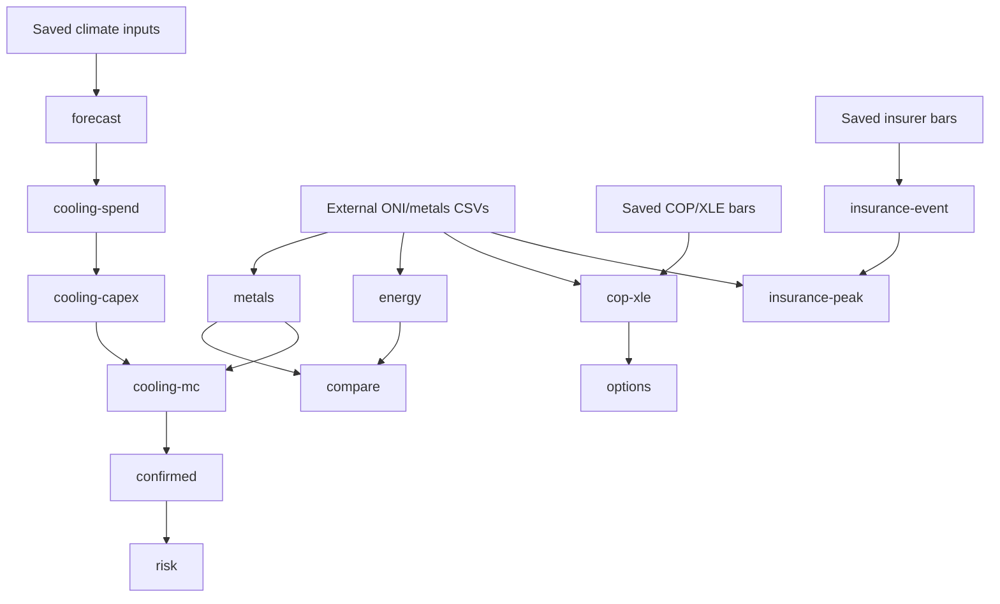

# Repository runbook

This is the operational guide for reproducing the ENSO cross-asset research from a
GitHub checkout. The default workflow is **offline**: it reads the climate, market,
news and options files already saved in the repository and makes no API request.

The research conclusions and methodology are in [`README.md`](README.md). The
machine-readable experiment history is in
[`enso_experiment_record.csv`](enso_experiment_record.csv).

## 1. Quick start

Run all commands from the repository root.

```bash
git clone <repository-url>
cd <repository-directory>
python3.14 -m venv .venv
.venv/bin/python -m pip install --upgrade pip
.venv/bin/python -m pip install -r requirements.txt
make help
```

The code was last verified with Python 3.14 and the exact package versions in
[`requirements.txt`](requirements.txt). Other Python versions may work but are not
the recorded environment.

On Windows PowerShell, replace `.venv/bin/python` with
`.venv\Scripts\python.exe`. The `make` shortcuts are optional; every underlying
Python command appears below.

## 2. Shared inputs

Most raw files are held inside their project directories. Two supplied datasets
used by several packages are stored once under [`inputs/`](inputs/):

- the directory containing `aligned_monthly_ONI_metals_1992_2026-07.csv`,
  `HAC_lag_tests.csv` and `rolling_60m_correlation_summary.csv`;
- `el_nino_insurance_stocks_massive.csv`.

No configuration is needed for the committed versions. To run a different authorized
copy without editing source code, set these optional variables:

```bash
export ENSO_METALS_INPUT_DIR="/absolute/path/to/ENSO_ONI_metals_correlation_package"
export ENSO_ONI_METALS_CSV="$ENSO_METALS_INPUT_DIR/aligned_monthly_ONI_metals_1992_2026-07.csv"
export INSURANCE_UNIVERSE_CSV="/absolute/path/to/el_nino_insurance_stocks_massive.csv"
```

Use absolute paths. `ENSO_METALS_INPUT_DIR` controls the full metals package;
`ENSO_ONI_METALS_CSV` controls the shared aligned panel used by the energy, COP/XLE,
Monte Carlo, insurer and straddle studies. No environment variable contains a
credential. Do not set these variables for the standard repository reproduction.

When overriding the committed inputs, confirm the files before a long run:

```bash
test -f "$ENSO_METALS_INPUT_DIR/HAC_lag_tests.csv"
test -f "$ENSO_METALS_INPUT_DIR/rolling_60m_correlation_summary.csv"
test -f "$ENSO_ONI_METALS_CSV"
test -f "$INSURANCE_UNIVERSE_CSV"
```

## 3. Fastest ways to run the repository

To rebuild every result from the saved inputs in dependency order:

```bash
make full-offline
```

To run all integrity and regression checks against the generated artifacts:

```bash
make test-all
```

To run one study, use its named target, for example:

```bash
make energy
make risk
make insurance-peak
```

`make full-offline` is intentionally not parallelized. Several studies consume
files generated by earlier stages, and parallel execution can read a partially
rewritten artifact.

## 4. Execution order and dependencies



The insurance/agriculture study and infrastructure-straddle study are otherwise
independent. Root README figures should be rebuilt last because they read outputs
from several studies.

## 5. Every offline analysis

The table gives the canonical target, direct Python equivalent and principal output.
Each analysis overwrites its own generated CSV/JSON/HTML files; it does not modify
raw inputs and does not place trades.

| Study | Run | Principal output |
|---|---|---|
| Seasonal ENSO forecast | `make forecast` | `enso_forecast_2026/ENSO_forecast_September_December_2026.html` |
| Insurance/agriculture | `make insurance-ag` | `enso_study/ENSO_insurance_agriculture_research.html` |
| Metals/cooling walk-forward | `make metals` | `enso_metals_walkforward/ENSO_metals_cooling_walkforward_report.html` |
| Energy peaks | `make energy` | `enso_energy_peaks/El_Nino_peaks_US_energy_backtest.html` |
| Raw-correlation comparison | `make compare` | `strategy_correlation_comparison/raw_correlation_strategy_comparison.html` |
| COP/XLE strong event | `make cop-xle` | `enso_cop_xle_strong_event_walkforward/COP_XLE_strong_El_Nino_walkforward_report.html` |
| COP/XLE options | `make options` | `enso_options_adaptation/ONI_COP_XLE_options_adaptation_report.html` |
| State cooling spend | `make cooling-spend` | `enso_datacenter_cooling_2026/ENSO_2026_datacenter_cooling_spend.html` |
| Cooling capex/suppliers | `make cooling-capex` | `enso_datacenter_cooling_capex_2026/ENSO_2026_cooling_capex_supplier_research.html` |
| Cooling Monte Carlo | `make cooling-mc` | `datacenter_cooling_monte_carlo_2026/datacenter_cooling_stock_monte_carlo_oct_dec_2026.html` |
| Cached-news pricing diagnostic | `make cooling-news` | `datacenter_cooling_monte_carlo_2026/calculated/news_attention_pricing.csv` |
| Confirmed cooling strategy | `make confirmed` | `enso_cooling_confirmed_strategy_2026/confirmed_enso_cooling_strategy_report.html` |
| Cooling risk overlays | `make risk` | `enso_cooling_confirmed_strategy_2026/cooling_strategy_risk_management_report.html` |
| Infrastructure straddles | `make straddles` | `dc_infrastructure_straddles_2026/DC_infrastructure_straddles_Apr_Sep_2026.html` |
| Insurer event study | `make insurance-event` | `insurance_oni_event_study/insurance_ONI_event_study.html` |
| Peak-El-Nino insurer strategy | `make insurance-peak` | `insurance_peak_strategy/peak_el_nino_insurance_strategy.html` |
| Root README figures | `make figures` | `docs/figures/*.png` |

### Direct Python commands

Use these when GNU Make is unavailable.

```bash
# Seasonal forecast: preparation -> estimation -> report
.venv/bin/python enso_forecast_2026/prepare.py
.venv/bin/python enso_forecast_2026/model.py
.venv/bin/python enso_forecast_2026/report.py

# Insurance and agriculture
.venv/bin/python enso_study/enso_study_analyze.py
.venv/bin/python enso_study/enso_study_report.py

# Cross-asset correlation and walk-forward studies
.venv/bin/python enso_metals_walkforward/run_analysis.py
.venv/bin/python enso_energy_peaks/run_analysis.py
.venv/bin/python strategy_correlation_comparison/run_compare.py
.venv/bin/python enso_cop_xle_strong_event_walkforward/run_analysis.py
.venv/bin/python enso_options_adaptation/run_analysis.py

# Data-center cooling research chain
.venv/bin/python enso_datacenter_cooling_2026/run_analysis.py
.venv/bin/python enso_datacenter_cooling_capex_2026/run_analysis.py
.venv/bin/python datacenter_cooling_monte_carlo_2026/run_analysis.py
.venv/bin/python datacenter_cooling_monte_carlo_2026/analyze_news_pricing.py
.venv/bin/python enso_cooling_confirmed_strategy_2026/run_analysis.py
.venv/bin/python enso_cooling_confirmed_strategy_2026/risk_management_analysis.py
.venv/bin/python dc_infrastructure_straddles_2026/run_analysis.py

# Insurance event and peak-period studies
MPLCONFIGDIR=/tmp/insurance-oni-mpl .venv/bin/python insurance_oni_event_study/run_analysis.py
MPLCONFIGDIR=/tmp/insurance-peak-mpl .venv/bin/python insurance_peak_strategy/run_strategy.py

# Root documentation figures
MPLCONFIGDIR=/tmp/enso-readme-mpl .venv/bin/python tools/build_readme_figures.py
```

The Monte Carlo and forecast scripts use fixed seeds recorded in source code. Run
the full entry point, rather than importing one internal function in an interactive
session, when comparing results with the committed report.

## 6. Tests

`make test-all` runs all test entry points in a deterministic sequence. Most tests
validate saved data, arithmetic, point-in-time restrictions, report completeness and
the absence of credentials from outputs. They are regression checks, not proof that
an economic hypothesis is true.

Run one project test directly when iterating:

```bash
.venv/bin/python enso_energy_peaks/test_analysis.py
.venv/bin/python enso_cooling_confirmed_strategy_2026/test_risk_management.py
.venv/bin/python insurance_peak_strategy/test_strategy.py
```

If a test reports a missing generated file, run the corresponding analysis target
first. A clean validation sequence is:

```bash
make full-offline
make test-all
```

## 7. What is offline and what is not

The following are offline analysis entry points:

- every `run_analysis.py` and `run_strategy.py` used by the Makefile;
- `prepare.py`, `model.py`, `report.py`, `analyze_news_pricing.py` and
  `risk_management_analysis.py`;
- every test and `tools/build_readme_figures.py`.

Files named `download*.py`, `enso_study/enso_study_download.py`,
`tools/query_massive_catalog.py`, `probe_massive_features.py` and the `discover` or
`download` modes of `tools/massive_history.py` are acquisition utilities. They are **not**
called by `make full-offline` or `make test-all`. They are retained for provenance
and should not be used for this frozen research version. `config.json` and
`config.example.json` intentionally contain no API key.

The read-only archive summary and request plan do not contact the network:

```bash
.venv/bin/python tools/massive_history.py plan --config config.example.json
.venv/bin/python tools/massive_history.py report --config config.example.json
```

## 8. Point-in-time climate joining utility

`tools/climate_join.py` is a standalone offline utility. It refuses climate records that
are not explicitly marked as verified point-in-time vintages.

```bash
.venv/bin/python tools/climate_join.py \
  --decisions path/to/decisions.jsonl \
  --features path/to/features.jsonl \
  --select oni temperature_anomaly precipitation_30d \
  --max-age-days 120 \
  --output path/to/joined_decisions.jsonl
```

Required decision fields are `decision_time` and `scope`. Required feature fields
are `scope`, `feature`, `value`, `observed_until`, `available_at` and
`point_in_time=true`. Timestamps must include a timezone. The output must differ
from both input paths.

## 9. Generated files and version-control policy

- `raw/` and `prepared/` contain source snapshots or normalized vendor responses.
- `calculated/` contains reproducible tables, manifests and diagnostics.
- project-root `.html` files are self-contained reports.
- `docs/figures/` contains the illustrations embedded in the root README.
- `enso_experiment_record.csv` is the experiment ledger.

Before committing a regenerated result, inspect both its numerical tables and HTML,
then run `make test-all`. Expected changes should be attributable to a source-data,
assumption or code change; avoid committing unexplained output drift.

Never commit:

- `config.json` or any credential-bearing file;
- `.venv/`, `__pycache__/`, `*.pyc` or `.DS_Store`;
- a refreshed vendor response unless its redistribution is permitted and its
  provenance is recorded.

Large redistributable raw files should use Git LFS or a versioned release asset.
If raw vendor data cannot be redistributed, publish the calculated result and an
input manifest/hash, and explain how an authorized user supplies the missing file.

## 10. Troubleshooting

### `FileNotFoundError` for a shared input

Confirm that [`inputs/`](inputs/) was included in the clone. If intentionally using
another copy, set `ENSO_METALS_INPUT_DIR`, `ENSO_ONI_METALS_CSV` and/or
`INSURANCE_UNIVERSE_CSV` as shown in section 2.

### `ModuleNotFoundError`

Confirm that the virtual environment is active or call its interpreter explicitly:

```bash
.venv/bin/python -m pip install -r requirements.txt
.venv/bin/python -c "import numpy, pandas, scipy, sklearn, xarray"
```

### Matplotlib cannot create a cache directory

Use a writable temporary cache:

```bash
export MPLCONFIGDIR=/tmp/enso-research-matplotlib
mkdir -p "$MPLCONFIGDIR"
```

### A report differs after rerunning

Check the project `calculated/provenance.json`, raw-file hashes and fixed random
seed. Also confirm that the same external CSV versions and exact dependency versions
were used. A source path that points to a newer file is a data change, not a harmless
path substitution.

### A test passes but the strategy still looks weak

That is expected for rejected hypotheses. Tests confirm implementation invariants;
they do not convert a high p-value, few independent events or poor out-of-sample
performance into evidence of alpha.

## 11. Safe contribution checklist

1. State the hypothesis before looking at the new result.
2. Preserve publication delays and information-time cutoffs.
3. Fit parameters only on the training window and freeze them for the test window.
4. Record transaction costs, tax assumptions and benchmark construction.
5. Add or update a test for every changed invariant.
6. Update `enso_experiment_record.csv` and the relevant project README.
7. Run `make full-offline` and `make test-all`.
8. Review generated HTML and figures before opening the pull request.

This workflow reproduces the saved research. It does not send orders and should not
be treated as investment advice.
